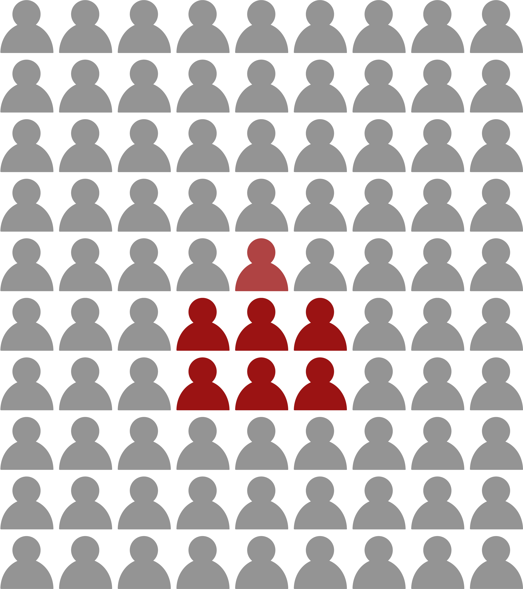
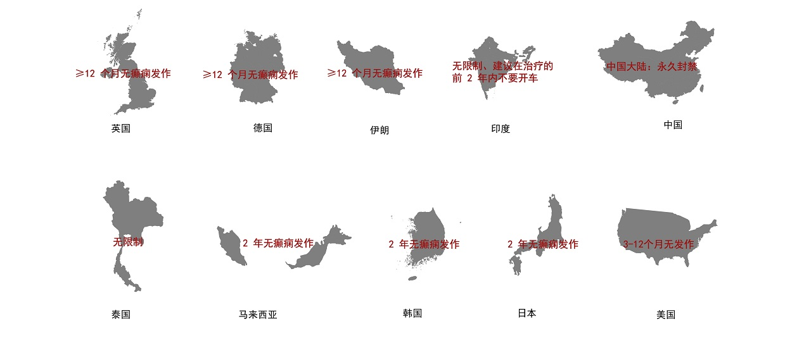
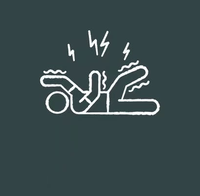
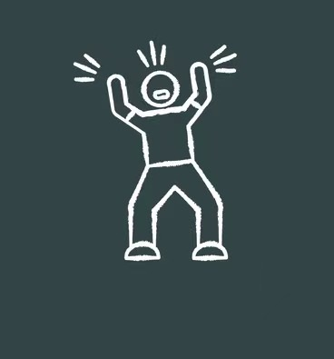

<!DOCTYPE html>
<html xmlns="http://www.w3.org/1999/html">
<head>
  <meta charset="utf-8">
  <meta http-equiv="X-UA-Compatible" content="IE=edge">
  <title>数据新闻—癫痫患者的精神迷宫</title>
  <meta name="description" content="">
  <meta name="viewport" content="width=device-width, initial-scale=1">
  <meta name="robots" content="all,follow">
  <!-- Bootstrap CSS-->
  <link rel="stylesheet" href="vendor/bootstrap/css/bootstrap.min.css">
  <!-- Font Awesome CSS-->
  <link rel="stylesheet" href="vendor/font-awesome/css/font-awesome.min.css">
  <!-- Custom icon font-->
  <link rel="stylesheet" href="css/fontastic.css">
  <!-- Google fonts - Open Sans-->
  <link rel="stylesheet" href="https://fonts.googleapis.com/css?family=Open+Sans:300,400,700">
  <!-- Fancybox-->
  <link rel="stylesheet" href="vendor/@fancyapps/fancybox/jquery.fancybox.min.css">
  <!-- theme stylesheet-->
  <link rel="stylesheet" href="css/style.default.css" id="theme-stylesheet">
  <!-- Custom stylesheet - for your changes-->
  <link rel="stylesheet" href="css/custom.css">
  <!-- Favicon-->
  <link rel="shortcut icon" href="favicon.png">
</head>
<body>
<!-- Navigation -->
<nav class="navbar navbar-expand-lg navbar-light fixed-top" id="mainNav">
  

    <a href="index.html" class="navbar-brand js-scroll-trigger">数据新闻—癫痫患者的精神迷宫</a>
    <button class="navbar-toggler navbar-toggler-right" type="button" data-toggle="collapse" data-target="#navbarResponsive" aria-controls="navbarResponsive" aria-expanded="false" aria-label="Toggle navigation">
      
    </button>
    

      <ul class="navbar-nav ml-auto">
        <li class="nav-item">
          <a href="index.html" class="nav-link  ">精神迷宫</a>
        </li>
        <li class="nav-item">
          <a href="#d1" class="nav-link ">隐匿之因</a>
        </li>
        <li class="nav-item">
          <a href="#d2" class="nav-link ">迫切之由</a>
        </li>
      </ul>
    

  

</nav>

<section style="background: url(img/kaitou.jpg); background-size: cover; background-position: center center" class="hero">
  

    

      

        

          <h1>
&nbsp
 癫&nbsp痫&nbsp患&nbsp者&nbsp的&nbsp精&nbsp神&nbsp迷&nbsp宫 </h1>

        

          <h2 class="h3">引言</h2>
          
 你听闻过精神迷宫吗? 那是一种被异常脑电波困住的疾病 全球有约&nbsp<strong>5000万人</strong>&nbsp在这座迷宫中彷徨
             每年约有&nbsp<strong>500万人</strong>陷入困局
             这座迷宫，在学术上的名字是—— <strong>癫痫</strong>

        

          

        

      

    

</section>
<!-- Intro Section-->

<section class="featured-posts no-padding-top no-padding-bottom">
  

    <!-- Post-->
    <section class="intro">
      

         
        

          

            <h1 class="h3">5000万</h1>
          

          

            <h1 class="h3">&nbsp&nbsp&nbsp&nbsp500万</h1>
          

          

            <h1 class="h3">&nbsp&nbsp&nbsp&nbsp&nbsp&nbsp&nbsp900万</h1>
          

          

            <h1 class="h3">&nbsp&nbsp&nbsp&nbsp&nbsp&nbsp&nbsp500万</h1>
          

        

         
        

          

            全球约5000万患者
          

          

            全球每年有约500万人被诊断为癫痫
            

          

                &nbsp&nbsp&nbsp&nbsp&nbsp&nbsp&nbsp全中国约900万患者
          

                

                  &nbsp&nbsp&nbsp&nbsp全中国每年新发作人数 &nbsp&nbsp&nbsp&nbsp&nbsp约为40万
                

        

      

      <section class="intro">
        

          

            <h2 class="h3">这并不是一个罕见的疾病</h2>
             
            
癫痫是一种慢性非传染疾病，特征为大脑活动异常，导致反复痫性发作或异常的行为、感觉，有时还会丧失意识。
             癫痫发作时，身体某一部位或整个身体短暂自主性抽搐（部分性或全身性发作），有时伴有意识丧失和尿便失禁。
             它可造成神经、认知、心理和社会后果，占世界疾病负担的很大一部分。

          

          

            

              
&nbsp

              
&nbsp

              <h2 class="h3">隐匿</h2>
              
 粗略地估计，在我国，<strong>每一百人</strong>中就有<strong>6到7人</strong>患有癫痫 然而这一疾病，似乎一直<strong>“隐匿”</strong>在人们的视野中

            

            

              
&nbsp

              
            

          

        

      </section>
      <section class="featured-posts no-padding-top no-padding-bottom">
        

          <!-- Post-->
          

            

                

                    <h2 class="h3">社会及学界的"忽视"</h2>

                   
                  
<strong>着眼我国社会生活</strong>，大部分人不认为自己身边存在癫痫患者，对其印象也仅停留于 <strong>“羊癫风”</strong>、<strong>“羊角风”</strong>等俗称。

                     <strong>在我国的学术领域</strong>，针对癫痫的研究，相较于其他更普遍的慢性病来说是很稀缺的,这也是脑部慢性病的普遍困境。  

                

            

&nbsp

            

            
图一&nbsp数据来源：PubMed（2023）

          

        

      </section>
    </section>
  

</section>
      </section>
    <!-- Post        -->
<section style="background: url(img/pexels-pixabay-414659.jpg); background-size: cover;  background-position: center center" class="hero">
  

    

      

        

          
<a name="d1">1</a>

          <h1> 被隐蔽的原因</h1>

      

    

  

</section>
<section class="featured-posts no-padding-top no-padding-bottom">
  

    

      

        

          
&nbsp;

          
 <strong>我们对比了癫痫与国内其他受关注较高的慢性疾病，发现比较之下癫痫仍属于“小众”的疾病。</strong>
              根据新版国际糖尿病联合会（IDF）地图数据显示，2021年我国糖尿病患者人数<strong>1亿4000万</strong>。
              据国家心血管病中心发布的《中国心血管健康与疾病报告2021》显示，我国高血压患病人数约为<strong>2.45亿</strong>。
              与此同时，2021年我国65岁以上帕金森病患病人数为<strong>318.6万</strong>人。

        

      

    

    
<strong>2021年我国主要慢性病统计患病人数</strong>

    

    

&nbsp;

      
图二&nbsp数据来源：国际糖尿病联合会，国家心血管病中心(2021)

    

  

</section>

<section class="featured-posts no-padding-top no-padding-bottom">
  

    

      

        

          
&nbsp;

          
同时，在对部分国际网站进行访问后，我们发现<strong>非洲国家对于癫痫的关注度远高于亚洲国家</strong>，这也和患病人数关系紧密。

        
参考网站：国际癫痫署、国际抗癫痫联盟等

        

      

    

    

    

      
图三&nbsp数据来源：Yemadje LP， Houinato D， Quet F， et al. 了解热带地区癫痫患病率的差异。癫痫。（2011）

    

  

</section>
<section class="featured-posts no-padding-top">
  

    

      

        

          
&nbsp;

          
 <strong>少数人的呼喊难以被听闻，是癫痫“被忽视”的原因之一。</strong>
            <strong>然而，一些本应为自己呼喊的患者，却选择了紧紧捂住嘴。污名化和病耻感，是谈论癫痫时绕不开的话题。</strong>
            由于人们对癫痫的不了解,癫痫呈现在大众视野中的零星片段,或许被冠以“羊癫疯”的可怖俗称,或许因其病发的难堪而招致物议沸腾,
            它似乎隐匿着，却又被赋予了触目惊心的可怕的社会意义。

          
&nbsp;

          
&nbsp;

          
在香港的一项研究中，<strong>94.1%</strong>的受访者认为癫痫患者可以结婚，
              但只有<strong>67.7%</strong>的人会允许他们的孩子与癫痫患者结婚，只有<strong>72.5%</strong>的受访者认为怀孕是合适的。

          

          
图四&nbsp数据来源：世界卫生组织（2019）

          
&nbsp

          
&nbsp

          
<strong>这样的污名化和排斥，这样的外界压力和恐惧，
                          化作一只名为“病耻感”的巨手，牢牢捂住癫痫患者的嘴
                          让他们不敢言说，将疾病变为深埋心底的“羞耻”，也将他们与社会分隔</strong>

          
&nbsp;

          
&nbsp;

          
研究显示，病耻感的存在降低了病人的积极性与社会活动的参与程度，
              与没有病耻感的癫痫病人相比，存在病病耻感的癫痫病人抑郁的发生率<strong>从6.6%增加至47.9%</strong>,
              焦虑的发生率从<strong>17.3%增加至62.5%</strong>。

        

      

    

  

</section>

  

</section>
<section style="background: url(img/3.jpg); background-size: cover; background-position: center center" class="hero">
  

    

      

        

          
<a name="d2">1</a>

          <h1>迫切之由——
            

             “公共卫生的当务之急”
          </h1>

      

    

  

</section>
<!-- Intro Section-->
<section class="intro">
  

    

      

        <h2 class="h3">•&nbsp;身体危害</h2>
        
&nbsp;

         
        
 癫痫给患者带来 <strong>巨大的</strong>身体危害

         
        癫痫患者过早死亡 的风险高达普通人群的三倍
        

      

        
      

    

  

</section>
<section class="featured-posts no-padding-top no-padding-bottom">
  

    <!-- Post-->
    

      

        

          

            <header class="post-header">
              
<strong>治疗条件却不容乐观</strong>

            </header>
            
将近<strong>80%</strong>的癫痫患者生活在低收入和中等收入国家，治疗差距在大多数低收入国家超过<strong>75%</strong>，在大多数中等收入国家超过<strong>50%</strong>。尽管抗癫痫发作药物有效且成本低，但仍然存在差距。

          

        

      

      
&nbsp;

      

      
图五&nbsp数据来源：世界卫生组织（2019）

    

    <!-- Post        -->
    

      

        

          
&nbsp;

          
&nbsp;

          <h2 class="h3">• 社会危害</h2></a>
          
&nbsp

           
          
由于病情的 <strong>突发性和长期性</strong>，癫痫患者在生活中会遇到种种困难，  抛开隐性的、不可量化的，他们的困境甚至呈现在白纸黑字的 <strong>法条</strong>中。

        

      

    

  

  

    
&nbsp;

    
&nbsp;

    

 

   
  
图六&nbsp数据来源：《Epilepsy in Asia: Disease burden, management barriers, and challenges》（2018）；《国内外癫痫患者驾驶机动车的现状分析》（2022）

  <!-- Post                            -->
  <section class="featured-posts no-padding-top no-padding-bottom">
    

      

        

          

            

              <sapn style="color: #333333"><strong>对驾驶的规定即是“限制”，也是“保护”，然而这样所谓的“保护”不只存在于白纸黑字中，在无数灰色地带也数不胜数。</strong></sapn>
                 <sapn style="color: #333333"><strong>我们和几位癫痫患者深入沟通</strong></sapn>
              <sapn style="color: #333333"><strong> 受访者之一——宁子，提到了她在“保护”下“破碎”的老师梦</strong></sapn>

 （宁子：26岁/女/自营蛋糕店）
 宁子小便期待着能成为一名老师，即使是生病以后也坚定地相信着教书育人未来。
                <sapn style="color: #333333"><strong>“但是总是被劝退那一种。“</strong></sapn>
               只要是在学校犯病、摔倒，老师就会劝说宁子和家里商量一下，在家养好病再来上学等等。
                <sapn style="color: #333333"><strong>在经历了休学、转学、相似的情况再次上演后……</strong></sapn>
               宁子便从初中辍学，开始步入社会。然而工作对她来说也并不简单，她提到了很多次拒绝，“太多人就是因为我身上这个病拒绝我”、“然后就是各种各种的拒绝”、“人不会当面的拒绝你，但是也不会再给你你打电话录入你”。
                <sapn style="color: #333333"><strong>“我知道得这个病的在社会上想立足有多难”</strong></sapn>

          

        

      

    

  </section>

    
或许这样的“保护”让癫痫患者更安全，也更符合其他许多人的利益， 然而“保护”之下造成的“破碎”，值得人们去反思“保护”与排斥的界限。

  

</section>

<!-- Latest Posts -->
<section class="latest-posts">
  

    <header>
      <h2>心理危害</h2>
      
 身体的不适、强烈的病耻感、难以融入的社会，给癫痫患者造成了巨大的心理压力

    </header>
    

      

        

        

          <h3>抑郁症<strong>23%</strong>和焦虑症<strong>20%</strong></h3>
          
 大约半数癫痫患者同时患有身体或精神方面的病症，最普遍的精神合并症是抑郁症（23%）和焦虑症（20%），智力残疾是癫痫儿童最常见的合并症（30%-40%）。

        

      

      

        

        

          <h3>抑郁症终生患病率可达<strong>30%</strong>甚至更高</h3>
          
 抑郁是癫痫病人常见的精神疾病之一，癫痫伴抑郁病人常表现为情绪低落、缺乏活力、失眠等，药物控制不佳的癫痫病人抑郁症终生患病率可达30%甚至更高。

        

      

      

        

        

          <h3 >癫痫伴抑郁的患病率达<strong>27%~58%</strong></h3>
          
 而在医院开展的研究中，癫痫伴抑郁的患病率达27%~58%。

        

      

    

  

</section>
<!-- Divider Section-->
</section>
<!-- Divider Section-->
<section  style=" background:url(img/6.6.jpg) ;background-size: cover;">
  

    

      

        

          
癫痫是困住患者的精神迷宫

          在这座精神迷宫里

          他们挣扎、碰壁、无功而返

          可构成迷宫的

          不仅仅是异常脑电波蜿蜒而成的小道

          更是忽视、偏见所垒起的高墙

        

          所以我们呼唤的、渴求的

          不是癫痫患者独自走出迷宫的毅力或勇气

          而是理性认知、消除成见、平等对待的

          ——推翻高墙的力量

          高墙坍塌，墙内的人才能被看到

          迷宫的意义不是被走出，而是被摧毁

          我们不应只是为独行者摇旗呐喊

          而应成为推到迷宫的千万只手

        

      

    

  

</section>

<!-- Page Footer-->
<footer class="main-footer">
  

    

      

        

          <h6>关于我们</h6>
        

        

          
Email: 1974704324@qq.com

          
小组成员：曹眷 罗文锐 余芸芸

          
指导老师：吴小坤

          
所在院校：华南理工大学

          
数据来源：

          
PubMed

          
Yemadje LP， Houinato D， Quet F， et al. 了解热带地区癫痫患病率的差异。癫痫(2011)

          
世界卫生组织，央视新闻客户端

          
国际糖尿病联合会，国家心血管病中心

          
《Epilepsy in Asia: Disease burden, management barriers, and challenges》

          
《国内外癫痫患者驾驶机动车的现状分析》

        

      

      

        

        

      

    

  

  

    

      

        

          
Copyright &copy; 2020.Company name All rights reserved.

        

        

          

        

      

    

  

</footer>
<!-- JavaScript files-->

<!-- Custom scripts for this template -->

</body>
</html>
